# 基于Springboot的学生请假管理系统 

# Springboot-025

### 技术栈

springboot mybatis  thymeleaf 

##  数据库

mysql (7张表)


## 运行截图

### 前台

### 后台

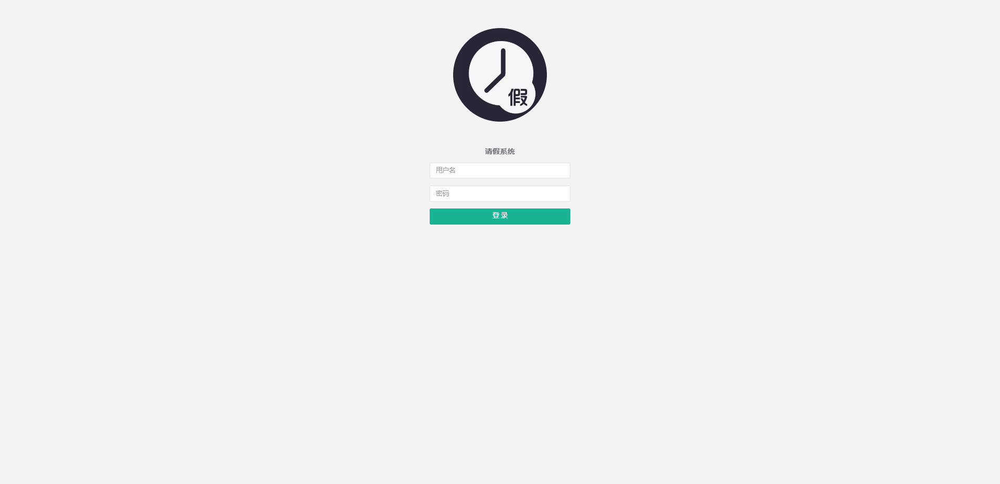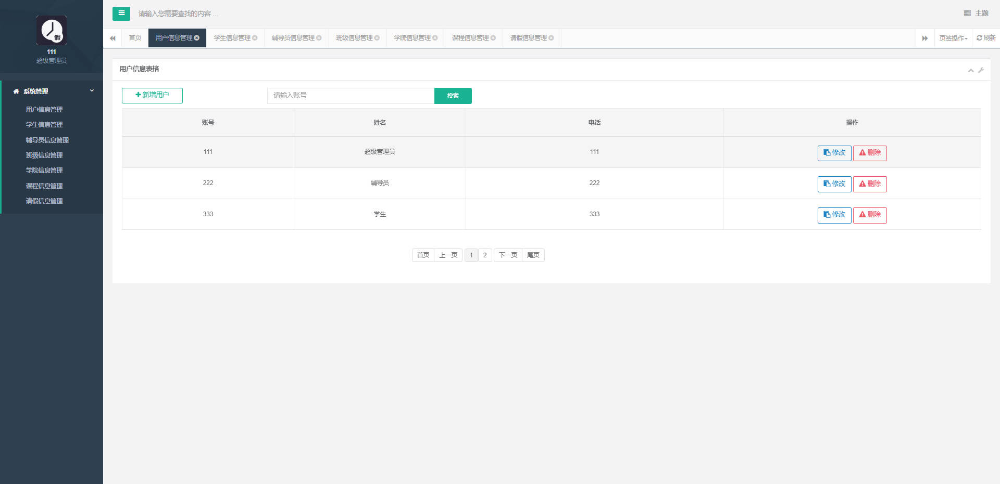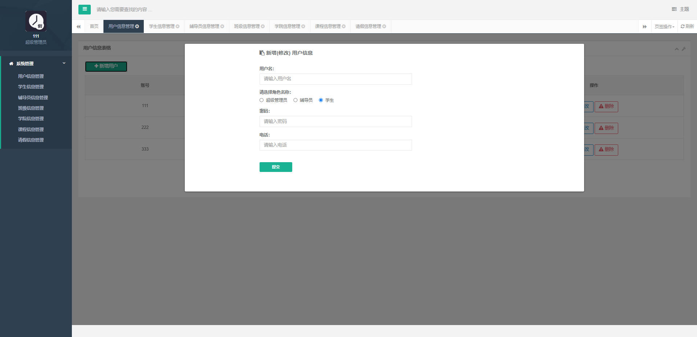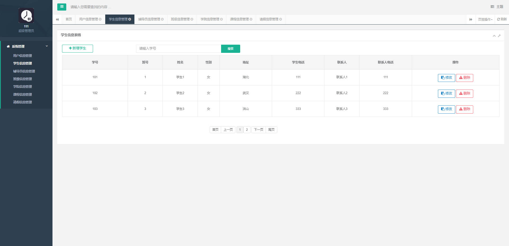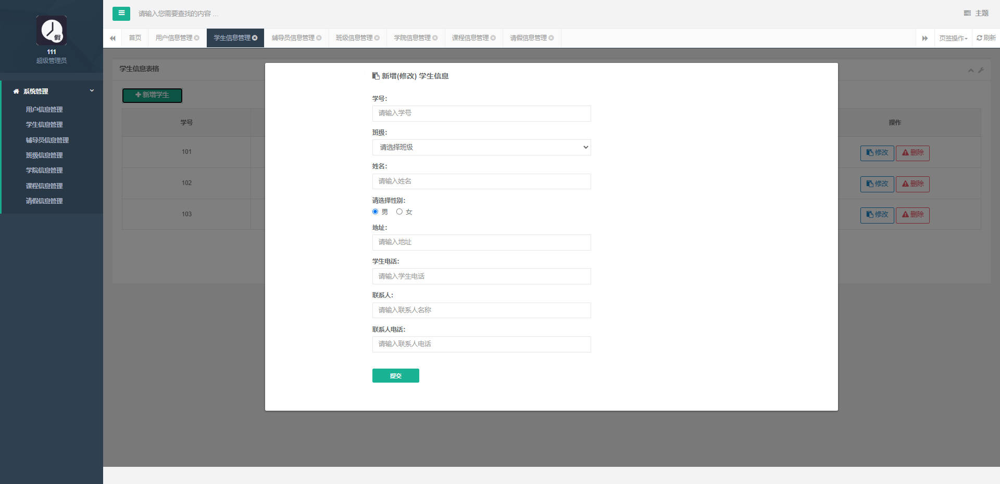

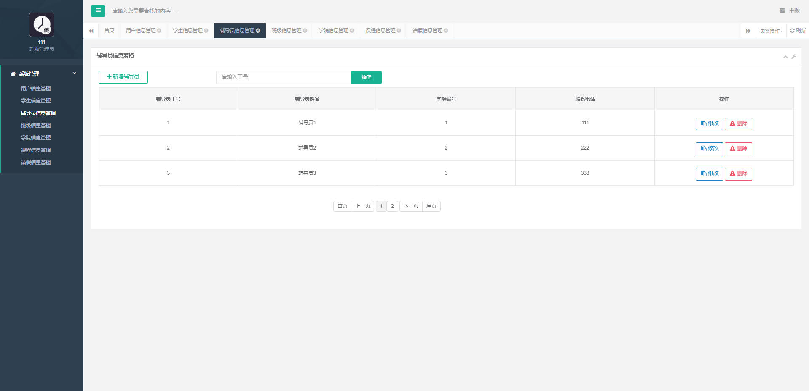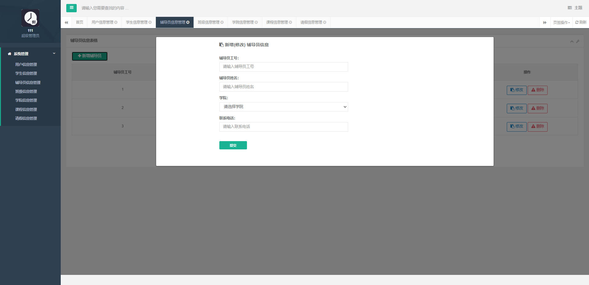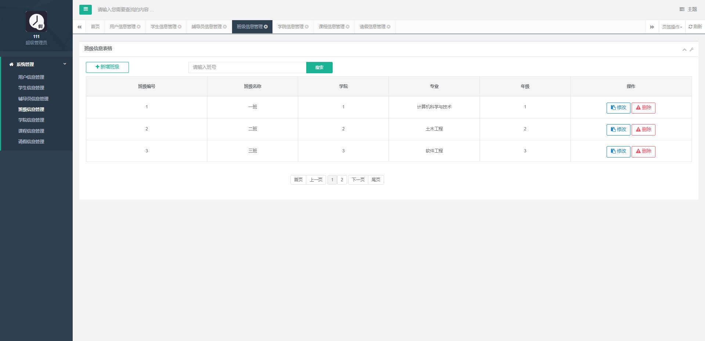

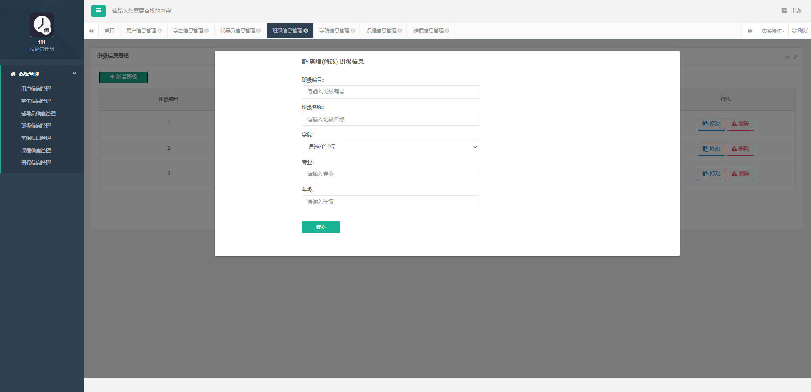

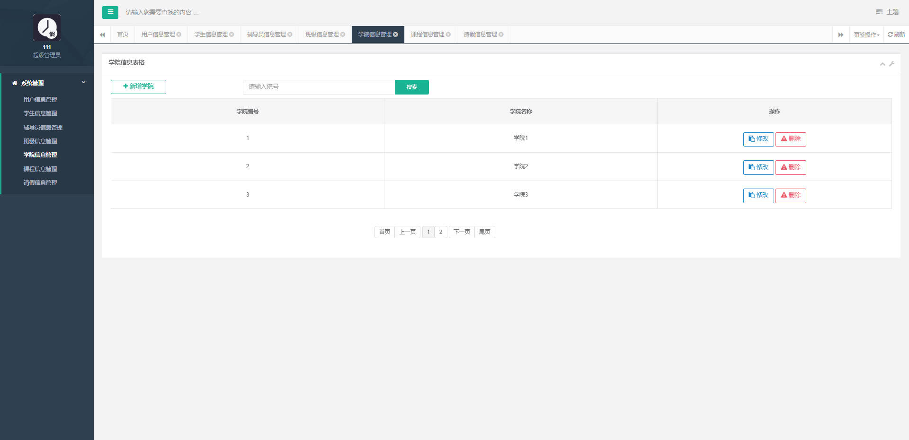

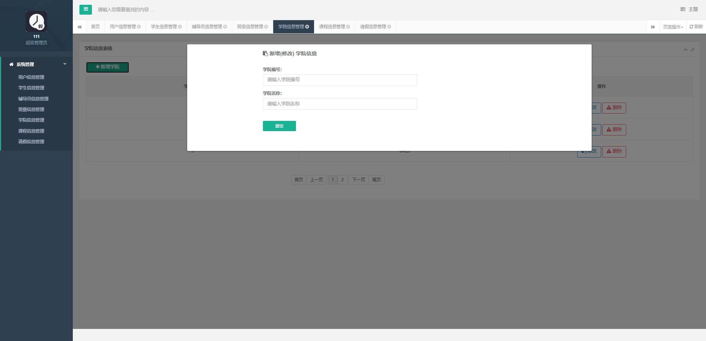

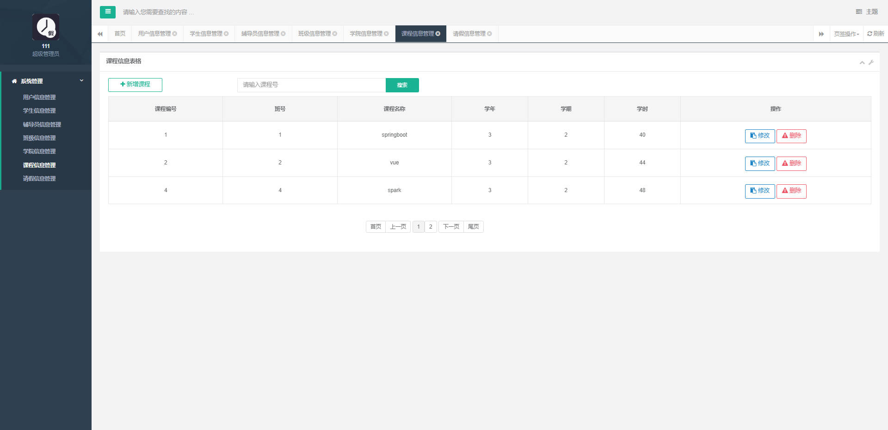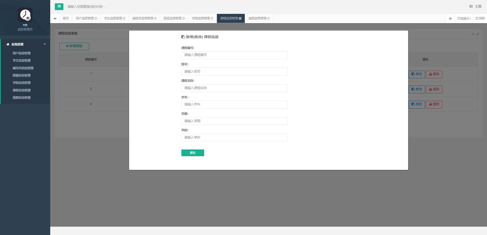

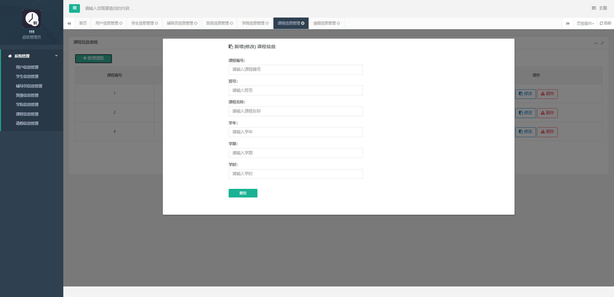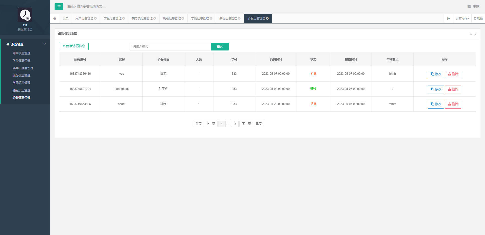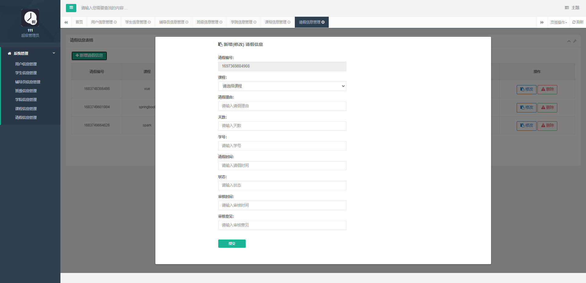


## 需要看运行视频或源码

```html
见images目录下面的a.txt文件

```


## 访问网址

### 前台

```

```

### 后台

```
http://localhost:8088/

账号 111
密码 1111
```


